### 硬件配置

+ 主板：微星MAG B460M MORTAR 
+ CPU：i7-10700K
+ 显卡：华硕 ROG-STRIX-RX5500XT-O8G-GAMING
+ 内存：铭瑄 DDR4 16G x 2
+ 硬盘：WD SN550 1TB
+ 电源：航嘉 GX700 Pro
+ 显示器：优派 VX2478-4K-HD
+ 无线网卡/蓝牙：BCM94360CS2【1200M 免驱】

### 软件版本

+ BIOS版本：E7C82IMS.120
+ OpenCore版本：0.6.3
+ MacOS版本：10.15.7 (19H15)
+ 网友测试 @yongjiaPython MacOS Big Sur 正常工作

### 功能

+ [x] 睡眠 唤醒
+ [x] 所有USB端口、USB3.0
+ [x] 独显免驱
+ [x] 板载声卡
+ [x] 板载网卡（需要手动设置）
+ [x] Airdrop（需要苹果网卡）

### 版本更新

###### 2020.11.3

+ 将opencore更新到0.6.3
+ 取消了图形化启动菜单
+ 增加了CleanNvram工具，更新完成好后需要清除一下Nvram
+ 老版本的0.6.1已经放入了`0.6.1`文件夹内，有需要的可以取用

### U盘制作（原版系统）

1. 使用MacOS前往App Store下载MacOS Catalina

2. 插入U盘（至少需要16G的空间）

3. 使用命令查看U盘的设备名

   ```bash
   diskutil list
   ```

   就是带有`external`的盘，我这边是/dev/disk2

4. 使用命令分区（会丢失U盘数据！！！）

   必须注意命令中的/dev/disk2与上面查看的相同，不然会丢失其他磁盘数据

   ```bash
   diskutil partitionDisk /dev/disk2 2 MBR FAT32 "OC EFI" 200Mi HFS+J "install_osx" R
   ```

5. 使用命令将MacOS Catalina写入到install_osx分区

   ```bash
   sudo /Applications/Install\ macOS\ Catalina.app/Contents/Resources/createinstallmedia --volume /Volumes/install_osx --nointeraction
   ```

6. 将下载的EFI文件夹放入OC EFI分区

### BIOS设置

关闭CFG锁、VT-D，根据@**[wanglelecc](https://github.com/wanglelecc)**提供的信息，还需要关闭 "MIS 快速启动" 选项

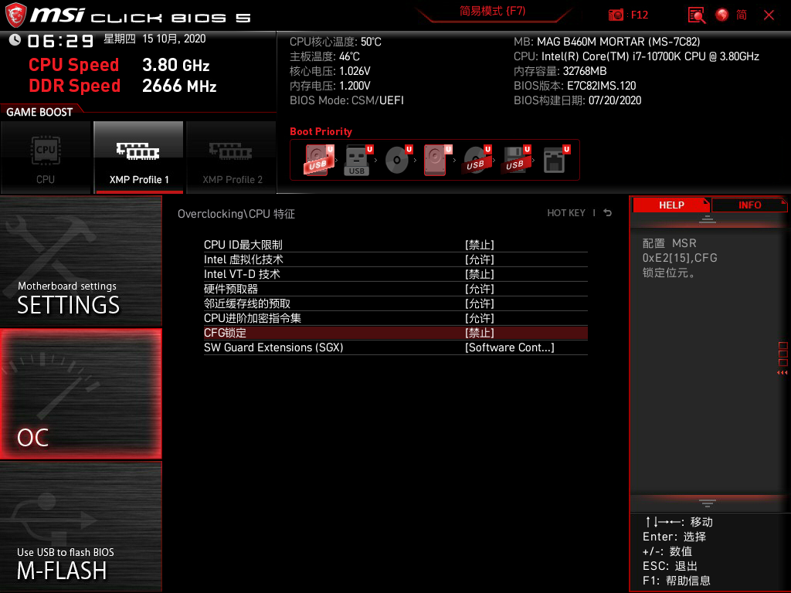

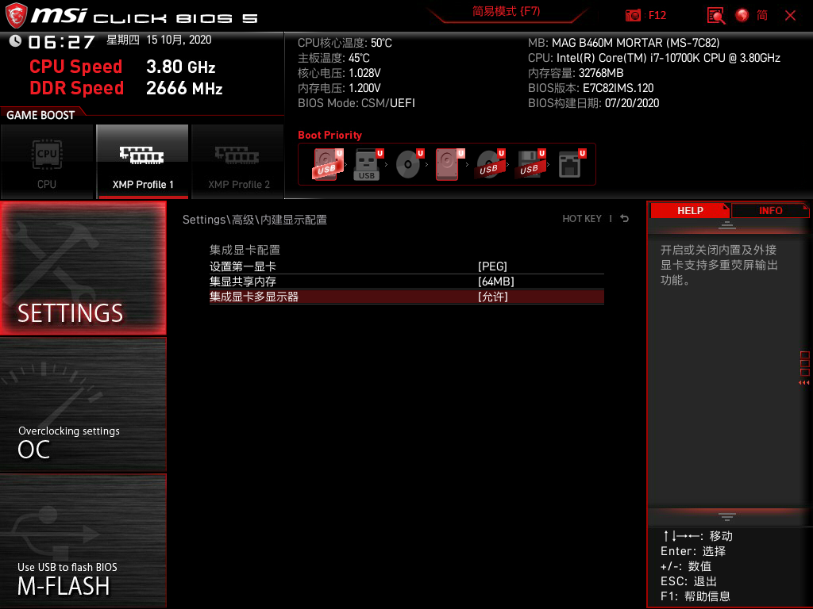

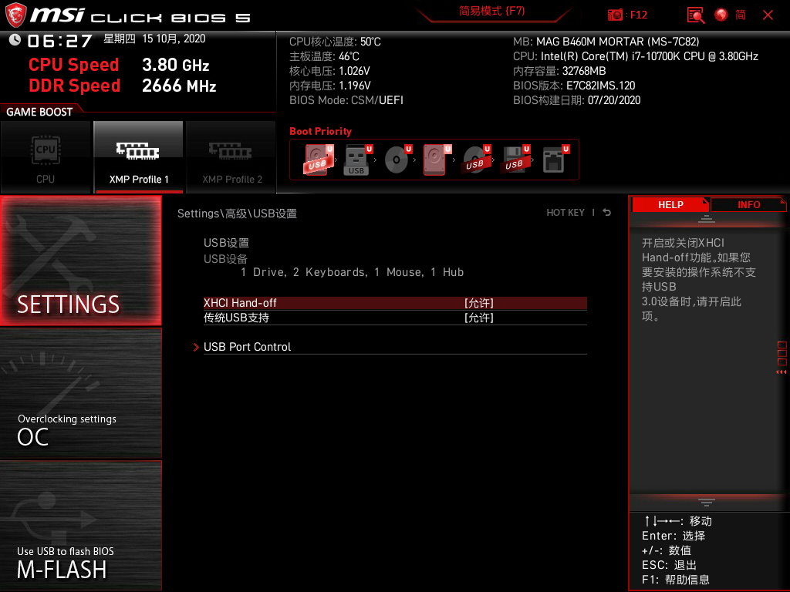

唤醒设置

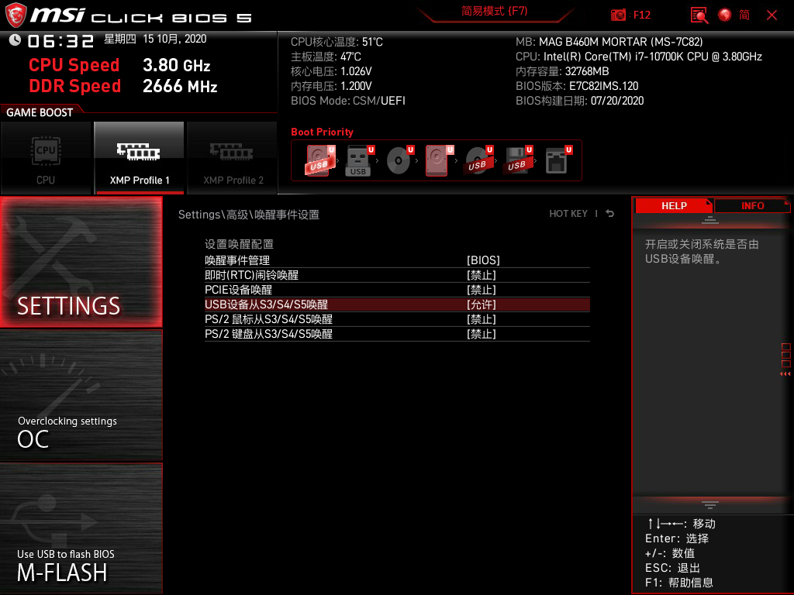

### 板载网卡说明

系统偏好设置 -> 网络 -> 以太网（高级） -> 硬件 -> 配置:手动, 速度:100baseTX(千兆网络环境可选择1000baseT，2.5G环境可以选择2500Base-T), 双工:全双工, MTU:标准1500

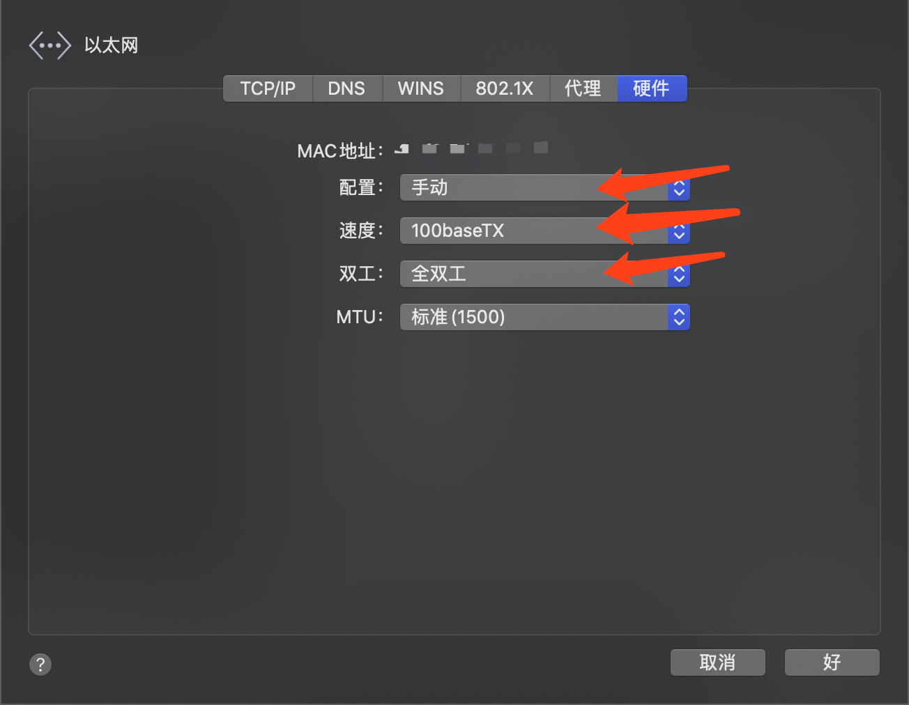

### 睡眠说明

- BIOS默认关闭了USB唤醒，睡眠后需按电源键唤醒

- 需鼠标键盘唤醒的，在BIOS里设置USB唤醒为允许即可（已修复开启USB唤醒时，关机后不断电操作鼠标或键盘会重新启动的问题）

- 使用Hackintool修复深度休眠预留空间，务必保证上面两条是绿色

  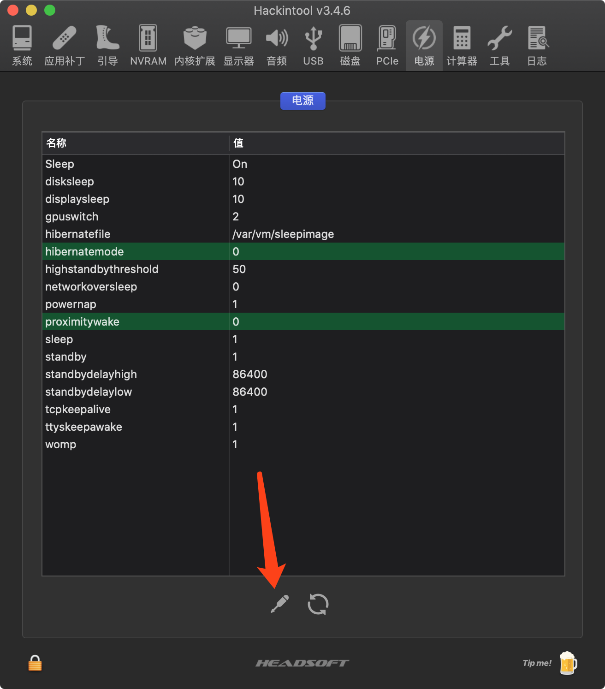

### Mac序列号说明

+ 经测试，B460M的主板最适合仿冒的机型是iMac19,1（推荐）请下载最新的EFI文件

+ 【方法1】下载 OpenCore Configurator for Mac，打开 PlatformInfo -> Model Lookup | Check Coverage 右侧选择 iMac19,1 机型（生成你的唯一硬件UUID），然后 Save as (另存为) config.plist

+ 【方法2】在config.plist文件中找到如下代码，记录MLB、SystemSerialNumber和SystemUUID的值并记住它，更新EFI时，用你记录的值替换 /OC/config.plist 下对应的值即可

  ```xml
  <key>PlatformInfo</key>
  <dict>
      <key>Generic</key>
      <dict>
          <key>AdviseWindows</key>
          <false/>
          <key>MLB</key>
          <string>==主板序列号==</string>
          <key>ROM</key>
          <data></data>
          <key>SpoofVendor</key>
          <true/>
          <key>SystemProductName</key>
          <string>iMac19,1</string>
          <key>SystemSerialNumber</key>
          <string>==序列号==</string>
          <key>SystemUUID</key>
          <string>==SmUUID号==</string>
      </dict>
  ```

+ 【方法3（推荐）】使用Hackintool摇号，填入到上面的字段中

  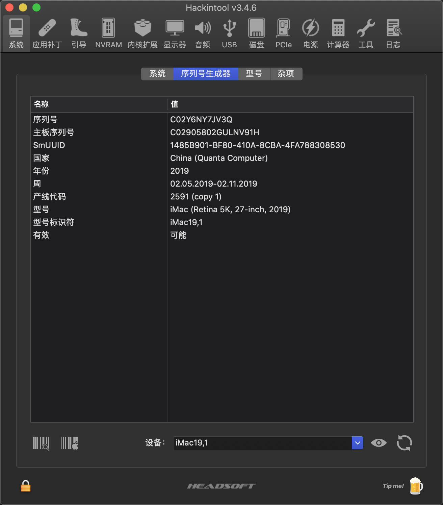

  

### Win+Mac双系统解决Win系统时间时差问题

- 在Windows下运行

  ```
  Reg add HKLM\SYSTEM\CurrentControlSet\Control\TimeZoneInformation /v RealTimeIsUniversal /t REG_DWORD /d 1
  ```

### 小贴士

###### 设置默认启动项

+ 在启动选择界面，先选中要启动的项，然后按住键盘的 Ctrl + Enter (回车键) 进入系统，下次重启后默认就选中这个项了。

###### 不显示启动菜单

+ 修改`config.plist`文件中的`ShowPicker`属性为`false`即可

###### 修改启动延时

+ 修改`config.plist`文件中的`Timeout`属性，单位是秒

###### 开启啰嗦模式

+ 修改`config.plist`文件，在`boot-args`中添加`-v keepsyms=1`

### 特别提醒

+ 如果系统有些卡顿，比如键盘输入延迟、长按输入不流畅、浏览器缩放卡顿，在OpenCore引导界面Reset Nvram一下即可。

+ 如果没有声音的话检查一下声音输出设备

  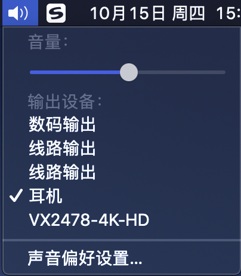
  
+ 如果使用的是两根天线的WiFi模块，建议使用5GWiFi，2.4G的WiFi对蓝牙有干扰。

### 鸣谢

1. https://github.com/myqqiu/Hackintosh-B460M-MORTAR-i5-10500-iGPU-UHD630
2. https://imacos.top/2020/08/16/1225/
3. https://www.tonymacx86.com/threads/micro-atx-build-msi-mag-b460m-mortar-i5-10500-rx470-open-core-catalina-10-15-5.299709/#post-2157841


### 安装成功的图片

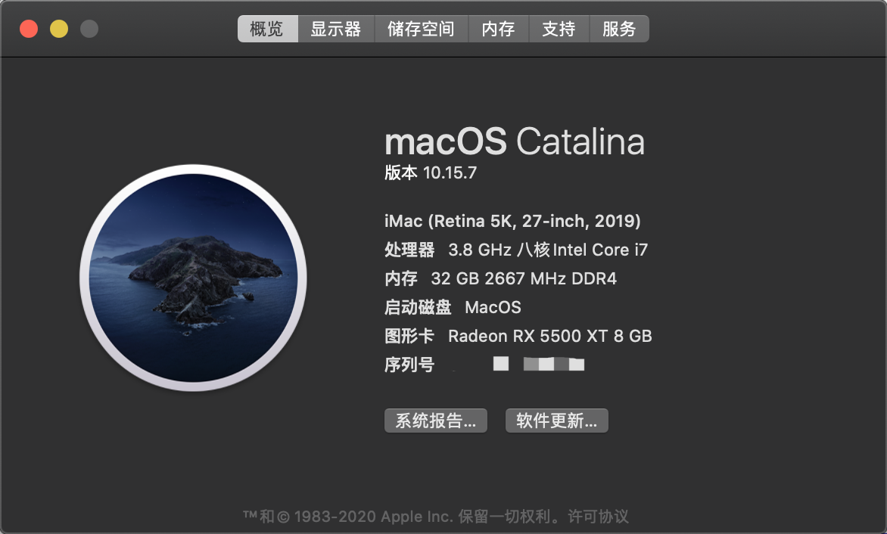

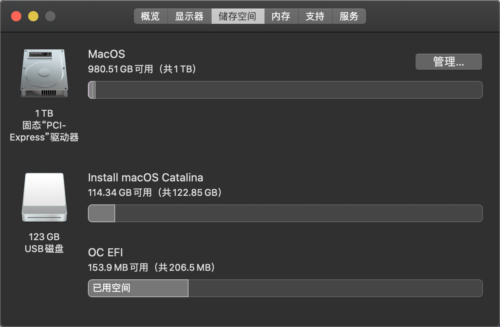

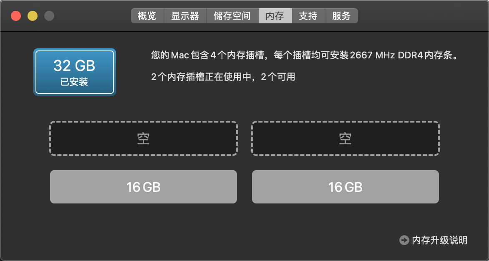

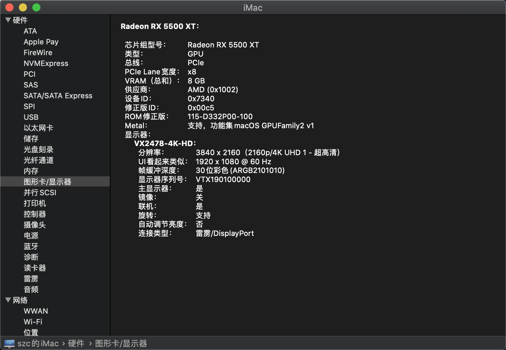

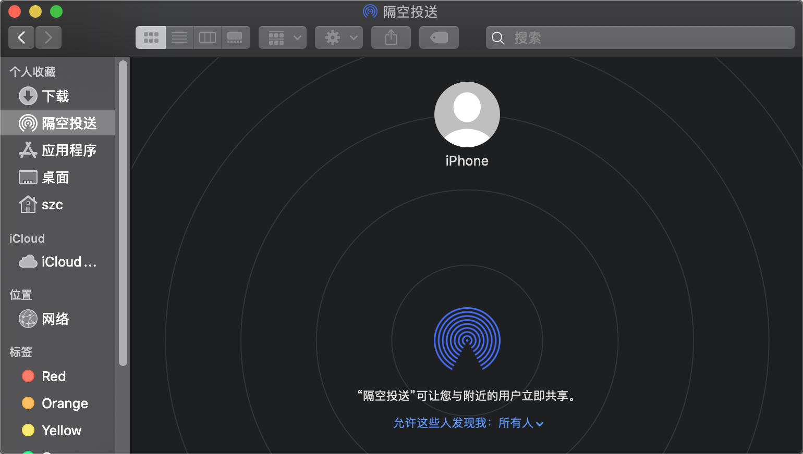


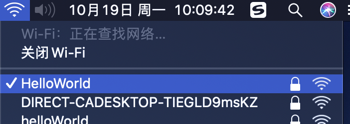

